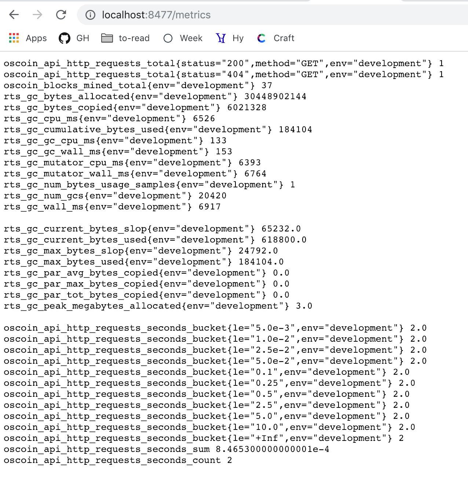
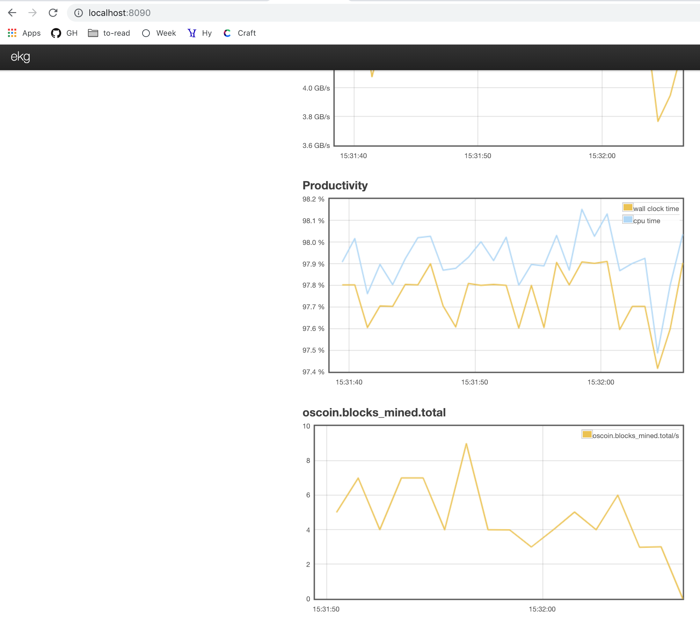

[//]: # (This section is a comment block, it won't be rendered.)
[//]: # (**NOTE**: This is a markdown file which desugars into a literate)
[//]: # (Haskell file which can be compiled and imported into `ghci`.)
[//]: # (**Do not** modify directly the `.lhs` file! Rather, edit this file)
[//]: # (directly and either run the tests via `stack test` or load the)
[//]: # (up-to-date file inside `ghci` by typing:)
[//]: # (stack ghci --ghci-options "-pgmL markdown-unlit")

# Telemetry

```haskell
{-# OPTIONS_GHC -fno-warn-unused-binds #-}
{-# OPTIONS_GHC -fno-warn-deprecations #-}
import Oscoin.Prelude

import Oscoin.Telemetry as Telemetry
import Oscoin.Telemetry.Middleware (telemetryMiddleware)
import Oscoin.Telemetry.Metrics (forkEkgServer, newMetricsStore, noLabels)
import Oscoin.Telemetry.Logging   as Log
import Oscoin.Crypto.Blockchain.Block
import Oscoin.Crypto (Crypto)
import Oscoin.Crypto.Hash.RealWorld ()

import qualified Network.Wai as Wai
```

It's always useful to monitor an application and gather
metrics on how it is behaving, especially if the latter is
a long-running process. The `oscoin` library exposes a flexible
telemetry machinery available at `Oscoin.Telemetry`.

## Initialisation

The first thing to do is to initialise the telemetry machinery:

```haskell
initTelemetry :: IO Telemetry.Handle
initTelemetry = do
  (logger, _flush) <- Log.stdLogger Log.defaultConfig
  metricsStore <- newMetricsStore noLabels
  pure $ Telemetry.newTelemetryStore logger metricsStore
```

In a normal application, you would probably have a `Logger`
and a `MetricsStore` as part of your application state, but here in this example we are creating them from scratch.

## Usage

Once you have acquired your `Telemetry.Handle`, you can
use it to _emit_ some interesting events:

```haskell
emitBlockMined :: IO ()
emitBlockMined = do
  handle <- initTelemetry
  let (b :: Block Crypto () Unsealed) = undefined -- Only for doc purposes
  Telemetry.emit handle (BlockMinedEvent (blockHash b))
```

Here `BlockMinedEvent` comes from `Oscoin.Telemetry.Events`
and it has type `NotableEvent`, which is a large GADT capturing
all the events worth logging/capturing within the system. If
you call `emit` in your code, you should see something like
this:

```
info  | mined block block_hash=2Drjgb4FtuUp21qXMePZpbFrmU2f5ZdL2QtTTKGaqnr3WBWeRr ns="node" loc="Oscoin.Node:108:26"
```

There are a bunch of things happening under the hood here:

1. The `emit` call is being performed with a frozen `Callstack` so that you get an accurate `SrcLoc` for your logging line;
2. The `NotableEvent` has been transformed into a [logfmt](https://brandur.org/logfmt)-friendly output and logged on stdout;
3. Some metrics have been distilled out of that event and stored inside the `MetricsStore`;

## Sampling metrics

As we have seen in the last section, every time you `emit` a new event, the telemetry machinery ensure some interesting metric is distilled out of that event and stored inside the
`MetricsStore`. Internally, the `MetricsStore` reuses some of
the [ekg-core](http://hackage.haskell.org/package/ekg-core) metric types but it also exposes new ones
(like the `Histogram`) which are actively inspired by [Prometheus](https://prometheus.io). The synergy with `Prometheus` is important as
it opens to the interesting possibility of exposing an HTTP
endpoint somewhere that Prometheus can scrape to store the time series, for later aggregation and monitoring with a dashboard like [Grafana](https://grafana.com/). Indeed this is something that the
`Oscoin.Telemetry.Middleware` already takes care of, and a
convenient Wai `Middleware` is already provided for you:

```haskell
getWaiMiddleware :: IO Wai.Middleware
getWaiMiddleware = do
  handle <- initTelemetry
  pure $ telemetryMiddleware handle
```

Thanks to the `telemetryMiddleware` you can now mount the `Middleware` in your network stack and
the metrics will be available at `/metrics` using Prometheus'
[exposition format](https://prometheus.io/docs/instrumenting/exposition_formats/):



Apart from domain-specific metrics, we also collect by default interesting GHC metrics
like the one relative to the RTS.

## Enabling EKG

While we designed the telemetry system to be Prometheus-friendly, we still support EKG for most (basic) metrics as it's very convenient to be able to fire the EKG dashboard and observe how a node is behaving. This is possible to do by doing something like:

```haskell
enableEKG :: IO ()
enableEKG = do
    let ekgHost = "localhost"
    let ekgPort = 8090
    -- Warning: Don't be tempted to create /another/
    -- 'MetricsStore' for the telemetry handle. Rather,
    -- reuse this one as these are meant to be \"singleton\"
    -- objects throughout your app. Ditto for the Logger.
    metricsStore <- newMetricsStore noLabels
    void $ forkEkgServer metricsStore ekgHost ekgPort
```

If you embed `enableEKG` in your `main`, you will now be
able to access (some) of the metrics via the EKG dashboard:



## Extending the Telemetry component

If you are a user of the telemetry component, chances are all
you want is to call `emit` in a bunch of places and let the system do the heavy lifting. However, it might happen that in the future
there might be events worth capturing that are not present in the `NotableEvent` enumeration. Suppose we want to introduce a new event called `MempoolSizeChanged` if we notice our mempool's size changed by a certain factor. In order to do that, we need to modify the `Oscoin.Telemetry` module in a bunch of places:

1. We need to add a new type constructor for the `NotableEvent` GADT;
2. We need to modify the big pattern matching inside `Oscoin.Telemetry.emit` to deal with the new constructor (but the compiler will warn us about this). At this stage we will need to pick what to log (or what not to);
3. We need to modify the `toActions` function (again, the compiler will tell us what to do) in order to map this event to the particular metrics we will need to update. With reference to our practical example, we might want to log something inside `emit` about the mempool's size changing, and perhaps inside our `toActions` either update a counter to keep track of how many events of this type we had or maybe even an histogram to categorise the size of the mempool over time (which might be a good idea regardless of this new event).

## Footer

_This last line is needed for the test machinery, ignore it._

```haskell
main :: IO ()
main = return ()
```
